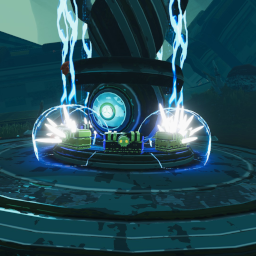

# AWUChestReward

Risk of Rain 2 mod. Replaces Alloy Worship Unit kill reward by legendary chest(s). The amount and the cost of this reward can be configured.

## Configuration
Every configuration entry is editable in-game via the [Risk Of Options](https://thunderstore.io/package/Rune580/Risk_Of_Options/) mod.

| Name                    | Type    | Default    | Description                                                                                                                                                                                                                      |
|-------------------------|---------|------------|----------------------------------------------------------------------------------------------------------------------------------------------------------------------------------------------------------------------------------|
| Enabled                 | Boolean | True       | True: mod is enabled and AWU will summon a chest on death. False: mod is disabled and default behaviour is restored.                                                                                                          |
| Base Cost               | Integer | 0          | Cost of the chest. Default Legendary chest cost is 400. 0 is free.                                                                                                                                                         |
| Scaling Mode            | Enum    | StageStart | Defines how the cost of chest scales : - None: Cost doesn't scale at all. - StageStart: Cost scales with the difficulty at the start of the stage. - OnKill: Cost scales with the difficulty at the time AWU is killed. |
| Scale With Player Count | Boolean | True       | True: spawns one chest for each player. False: spawns only one chest disregarding the amount of players.                                                                                                                      |

## TODO

- [x] Add an animation when the chests are spawning.
- [ ] Add sounds to the spawn animation.
- [ ] Fancier animation ?

## Credits

- [Race](https://www.twitch.tv/race "twitch.tv/race") for the original idea : [clip](https://clips.twitch.tv/create/ShyPoorKleeBuddhaBar-OCENL05lBydkFlSI)
- Nuxlar's mod [ReplaceAWU](https://thunderstore.io/package/Nuxlar/ReplaceAWU/) for the similar implementation.